# Screenshot Inbox


**A local-first macOS inbox for organizing screenshots before they become desktop clutter.**

Screenshot Inbox watches for screenshots, keeps them in a visual library, and gives you fast tools for reviewing, renaming, tagging, searching, dragging, sharing, and exporting them. It feels closer to an Apple-native capture desk than a Finder folder: everything is searchable, selectable, previewable, and ready to clean up when you are done.

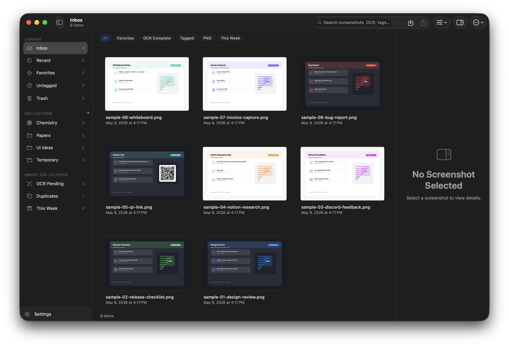

> **Alpha status:** Screenshot Inbox is usable for hands-on testing, but it is still pre-release software. Keep backups of important screenshots and expect rough edges around packaging, permissions, and some advanced workflows.

## Quick Demo

<video src="README-assets/demo.mp4" controls width="900" poster="README-assets/demo-poster.png"></video>

[Open the demo video directly](README-assets/demo.mp4) if the embedded player does not render in your GitHub client.

## Install With Git Clone (Recommended)

The recommended way to try Screenshot Inbox during alpha is to build and run it from source:

```bash
git clone https://github.com/Chihen-Tai/Screenshot-inbox_V2.git
cd Screenshot-inbox_V2
swift build
swift run ScreenshotInbox
```

Requires macOS 14 or later and Swift 5.10 or later. If you prefer Xcode, open `Package.swift` after cloning.

## Why Use It?

Finder is good at storing files. Screenshot Inbox is built for the messy few minutes after you capture something.

| Finder folders | Screenshot Inbox |
| --- | --- |
| Screenshots land as a pile of timestamped files. | New captures appear in a visual inbox with thumbnails, metadata, OCR, and quick actions. |
| Renaming, tagging, previewing, and exporting are separate workflows. | Rename, tag, favorite, search, copy, Quick Look, trash, and export without leaving the app. |
| Sharing often means hunting through Desktop or Downloads. | Drag selected screenshots into Discord, Notion, Slack, Finder, or any app that accepts files/images. |
| Combining images into a PDF requires another tool. | Select screenshots and export them as a single PDF with layout options. |

## Feature Highlights

- **Visual screenshot inbox:** Review screenshots as large thumbnails in a native macOS grid.
- **Floating Preview:** Keep recent captures in a small panel with copy, open, Quick Look, export, and trash actions.
- **Finder-style selection:** Select one, range-select, multi-select, or press `Cmd+A` to select all visible screenshots.
- **Drag, copy, and share:** Drag images out, copy image/file/path/Markdown references, or use the system Share sheet.
- **Fast rename and tagging:** Rename a screenshot with `Return`; add tags to one or many screenshots.
- **Collections and smart views:** Use Inbox, Recent, Favorites, Untagged, Trash, user collections, OCR Pending, Duplicates, and This Week.
- **OCR-powered search:** Search filenames, tags, collections, OCR snippets, source paths, detected codes, and typed operators.
- **QR and code detection:** Detect QR/barcode payloads, copy detected text, and open detected links.
- **PDF export:** Combine selected screenshots into a PDF with page size, orientation, margins, image fit, and ordering controls.
- **Local-first library:** Imported files are copied into a managed library on your Mac. OCR and code detection use Apple frameworks locally.
- **Optional AI suggestions:** Inline rename/tag suggestions can run with local rules by default; Google AI Studio support is optional and keychain-backed.

## Visual Tour

| Sidebar and smart collections | Multi-selection and batch actions |
| --- | --- |
| 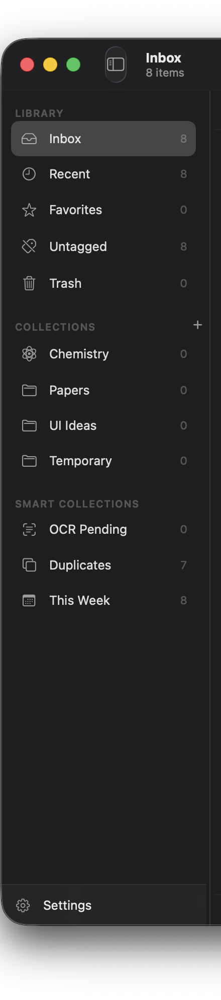 | 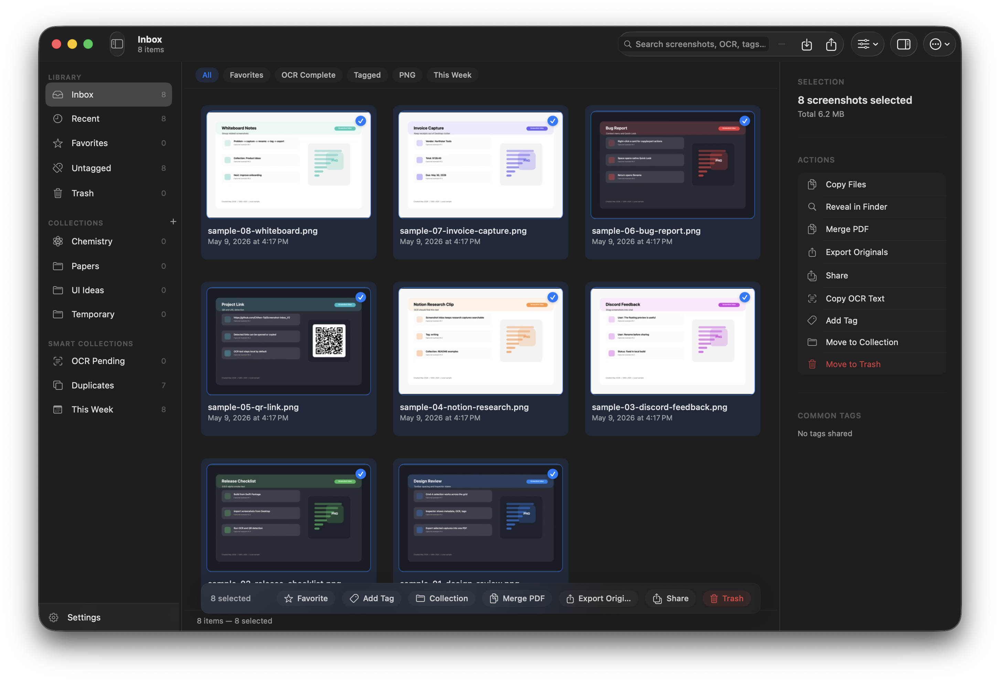 |

| Rename flow | Tag editing |
| --- | --- |
| 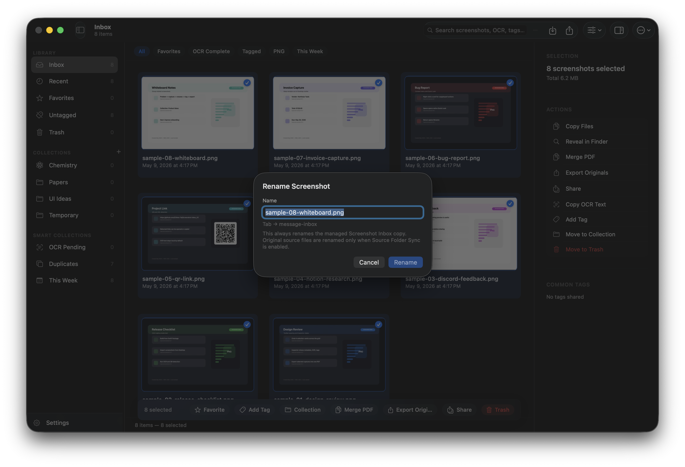 | 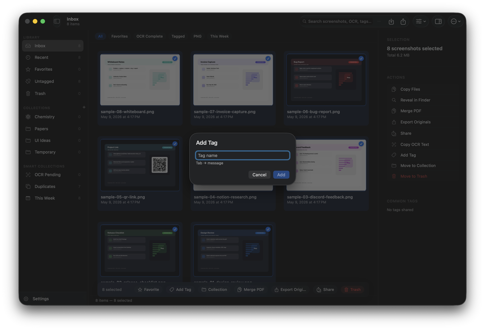 |

| PDF export | Quick Look preview |
| --- | --- |
| 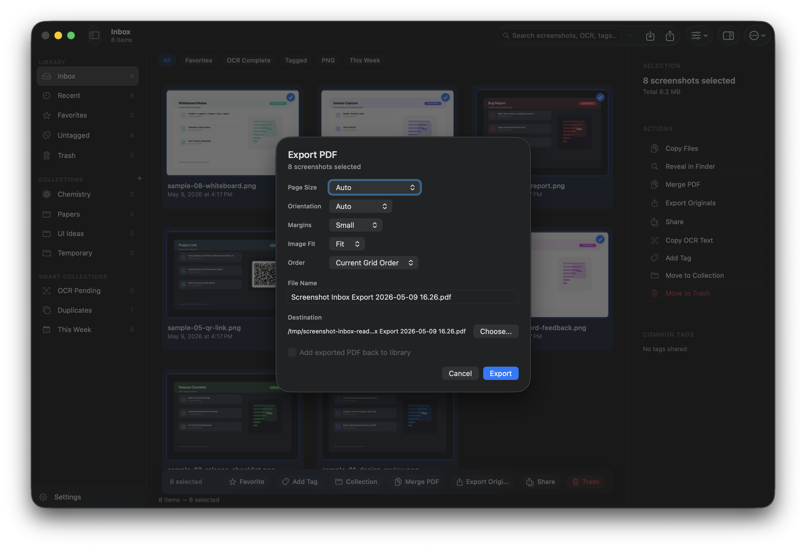 | 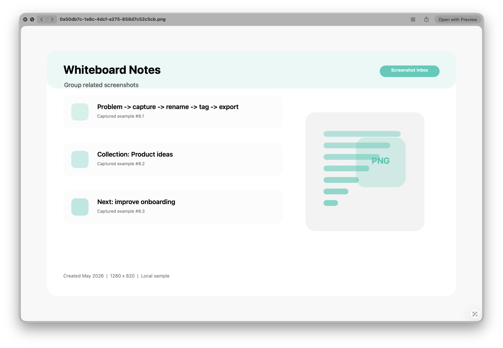 |

| Floating Preview | Context menu actions |
| --- | --- |
| 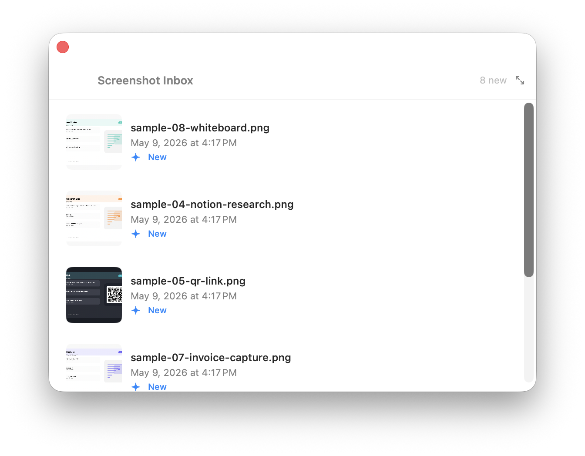 | 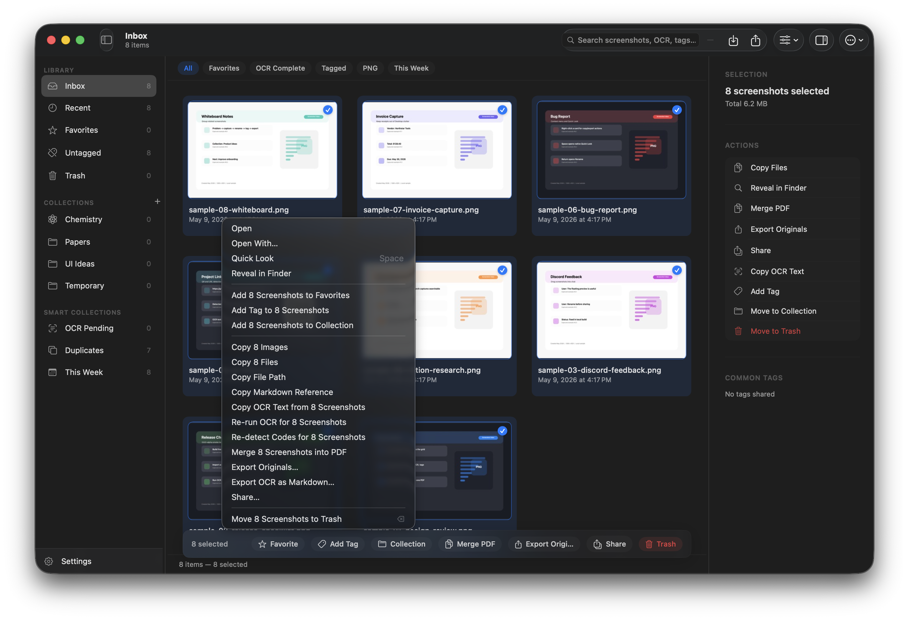 |

| Settings | OCR configuration |
| --- | --- |
| 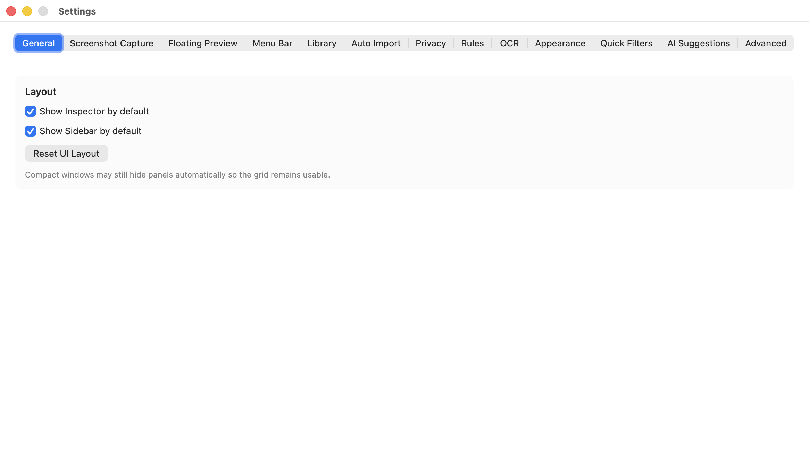 | 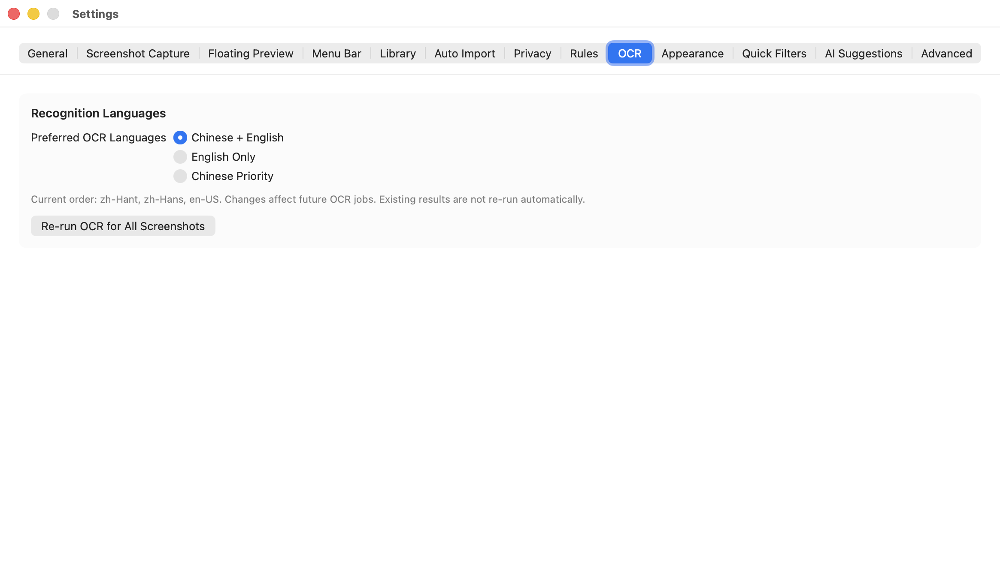 |

| Drag, copy, and app handoff |
| --- |
| 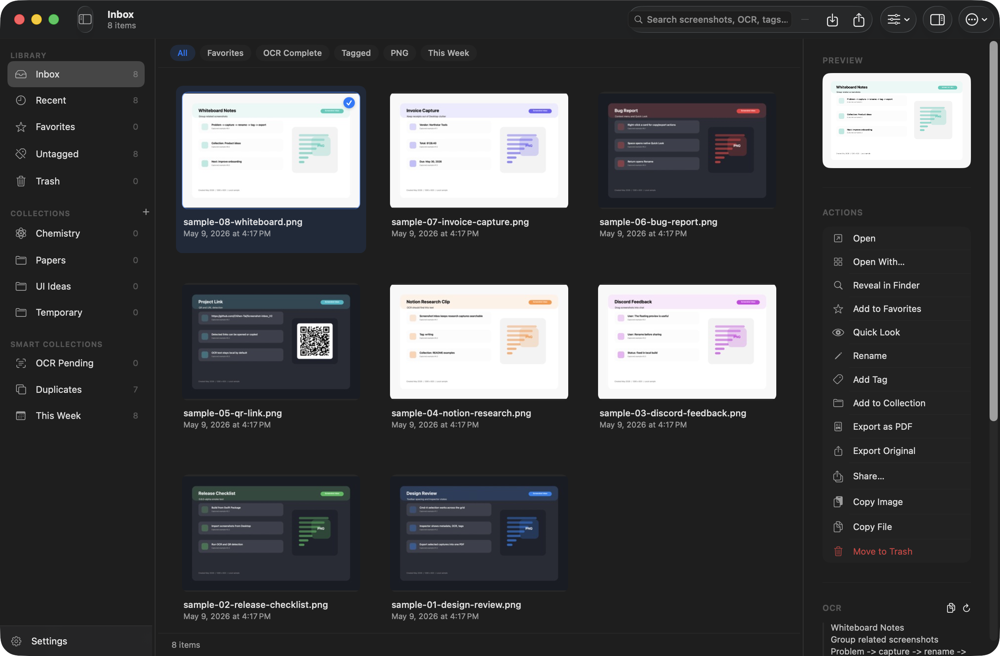 |

## Example Workflow

1. Take screenshots with the normal macOS screenshot shortcuts.
2. Screenshot Inbox imports the new images from configured screenshot folders or watched folders.
3. Review them in the Floating Preview or open the main inbox.
4. Select the useful captures, press `Return` to rename, and add tags or collections.
5. Search later by title, tag, OCR text, source folder, file type, QR payload, or date.
6. Drag screenshots into Discord, Notion, Slack, Finder, or another app.
7. Press `Cmd+Shift+E` to combine selected screenshots into a PDF.
8. Move unneeded captures to Screenshot Inbox Trash, then restore or permanently delete them later.

## Using The App

### Import Screenshots

Screenshot Inbox can bring images in three ways:

- Watch the macOS screenshot folder/Desktop flow through the screenshot watcher.
- Auto-import from folders configured in **Settings -> Auto Import**.
- Use **File -> Import Screenshots...** or the toolbar import button for manual imports.

Supported import formats include PNG, JPEG, HEIC, TIFF, GIF, and BMP. Imported files are copied into the managed Screenshot Inbox library by default, so normal app cleanup does not immediately delete your original Desktop or Downloads files.

### Organize Quickly

Use the sidebar for broad buckets:

- **Inbox:** the main library view.
- **Recent:** recently captured/imported screenshots.
- **Favorites:** items marked as important.
- **Untagged:** screenshots that still need organization.
- **Trash:** app-level trash with restore and permanent delete actions.
- **Collections:** custom groups for projects, topics, papers, UI ideas, or temporary work.
- **Smart Collections:** OCR Pending, Duplicates, and This Week.

Use the filter chips above the grid for fast narrowing: All, Favorites, OCR Complete, Tagged, PNG, and This Week are visible by default. More chips can be enabled in **Settings -> Quick Filters**.

### Search

The search field matches filenames, tags, collection names, OCR snippets, source paths, source app names, file formats, and detected code payloads.

Useful operators:

| Query | Finds |
| --- | --- |
| `tag:invoice` | Screenshots with a matching tag |
| `collection:papers` | Screenshots in matching collections |
| `has:ocr` | Screenshots with completed OCR text |
| `has:qr` | Screenshots with detected codes |
| `has:url` | Screenshots with detected links |
| `is:favorite` | Favorited screenshots |
| `is:trash` | Trashed screenshots |
| `type:png` | Screenshots by image format |
| `source:desktop` | Screenshots from matching source paths/apps |
| `date:today` / `date:this-week` | Recent date scopes |

### Preview, Copy, Drag, And Share

Use `Space` or the context menu for Quick Look. The inspector and context menu expose Open, Open With, Reveal in Finder, Copy Image, Copy File, Copy File Path, Copy Markdown Reference, Copy OCR Text, Share, and export actions.

Selected screenshots can be dragged out of the grid as files/images into apps that accept standard macOS pasteboard data. Sidebar drop targets also support adding dragged screenshots to Favorites, Trash, or a collection.

### Rename And Tag

Select a single screenshot and press `Return`, choose **Rename**, or use the context menu. Tags can be added from the batch bar, context menu, or inspector. Inline suggestions appear in rename/tag fields when AI suggestions are enabled; local rules are used by default.

### Export PDFs And Originals

Use `Cmd+E` to export selected originals, or `Cmd+Shift+E` to export selected screenshots as a PDF. PDF export currently supports:

- Page Size: Auto, Original, A4, Letter
- Orientation: Auto, Portrait, Landscape
- Margins: None, Small, Medium
- Image Fit: Fit or Fill
- Order: current order, date, or filename

The "Add exported PDF back to library" toggle exists in the UI but is disabled until PDF re-import is implemented.

### Settings

Settings currently include:

- General layout defaults
- Screenshot capture behavior
- Floating Preview behavior
- Menu bar badge behavior
- Library path, source-folder sync, and maintenance tools
- Auto-import sources
- Privacy controls
- Organization rules
- OCR language presets
- Appearance
- Quick filter configuration
- AI suggestion provider settings
- Advanced/debug tools in debug builds

## Installation

### Requirements

- macOS 14 or later
- Swift 5.10 or later
- Xcode 15.3 or later recommended
- Apple Vision framework support for OCR and code detection

### Run From Source

```bash
git clone https://github.com/Chihen-Tai/Screenshot-inbox_V2.git
cd Screenshot-inbox_V2
swift build
swift run ScreenshotInbox
```

This repository is a Swift Package Manager executable app, not a traditional checked-in Xcode project. If you prefer Xcode, open `Package.swift`.

### Build A Local App Bundle

```bash
scripts/build-release.sh
open "dist/Screenshot Inbox.app"
```

Create local ZIP or DMG packages:

```bash
VERSION=0.6.0-alpha scripts/package-zip.sh
VERSION=0.6.0-alpha scripts/package-dmg.sh
```

Local bundles are ad-hoc signed unless you provide signing environment variables. macOS may warn about unsigned or non-notarized builds. For local testing, open the app with right-click -> **Open**, or remove quarantine from a build you created yourself:

```bash
scripts/remove-quarantine-local.sh "dist/Screenshot Inbox.app"
```

### Permissions And Privacy

Screenshot Inbox does not require an account and does not upload screenshots by default. Grant file/folder access when you add watched folders or import from protected locations. Optional Google AI Studio suggestions require an API key stored in macOS Keychain and send OCR text plus screenshot metadata to Google's Gemini API; raw screenshots are not uploaded by that feature in the current implementation.

See [PRIVACY.md](PRIVACY.md) for the full privacy notes.

## Keyboard Shortcuts

| Shortcut | Action |
| --- | --- |
| `Cmd+O` | Open the main inbox |
| `Cmd+,` | Open Settings |
| `Cmd+A` | Select all visible screenshots |
| `Cmd+Shift+A` | Clear selection |
| `Esc` | Close overlay/preview first, then clear selection |
| `Space` | Quick Look / preview selected screenshot |
| `Return` | Rename the primary selected screenshot |
| `Delete` / `Forward Delete` | Move selected screenshots to app Trash |
| `Cmd+Delete` | Move selected screenshots to app Trash |
| `Cmd+C` | Copy selected screenshots or text, depending on focus |
| `Cmd+X` | Cut selected screenshots or text, depending on focus |
| `Cmd+V` | Paste clipboard images/files into the inbox or text into focused fields |
| `Cmd+R` | Reveal selected screenshots in Finder |
| `Cmd+E` | Export selected originals |
| `Cmd+Shift+E` | Export selected screenshots as a PDF |
| `Cmd+Option+I` | Toggle the inspector |
| `Left` / `Right` | Move between screenshots in the image preview overlay |
| `Cmd++` / `Cmd+-` | Zoom image preview in/out |
| `Cmd+0` | Fit image preview |
| `Cmd+1` | Show image preview at actual size |

Floating Preview also supports `Cmd+C`, `Cmd+O`, `Space`, `Return`, `Cmd+R`, `Delete`, `Cmd+Delete`, `Esc`, and `Cmd+Return` for quick capture handling.

## Architecture Overview

Screenshot Inbox is a native SwiftUI/AppKit macOS app packaged with Swift Package Manager.

```text
ScreenshotInbox/
  App/                 SwiftUI entry point, app state, commands, routing, release info
  AppKitBridge/        NSCollectionView grid, context menus, drag/drop, shortcuts, floating panel
  Core/                Shared service protocols
  Models/              Value types for screenshots, tags, collections, OCR, codes, exports
  Persistence/         SQLite database, repositories, migrations
  Platform/macOS/      macOS implementations for import, OCR, QR/code detection, PDF, trash, share
  Services/            Search, auto import, source sync, AI suggestions, library maintenance
  UI/                  SwiftUI windows, sidebar, grid, inspector, preview, settings, export sheets
  Utilities/           Theme, logging, file helpers, metadata, security bookmarks
Tests/
  ScreenshotInboxTests/
```

Key implementation points:

- `AppState` is the main `@MainActor` state object and owns selection, search, filters, routing, preferences, services, and UI sheets.
- The screenshot grid is `NSCollectionView` embedded in SwiftUI for AppKit-grade selection, menus, drag-out, and keyboard behavior.
- The managed library stores originals, thumbnails, exports, and SQLite metadata under `~/Pictures/Screenshot Inbox Library/` by default.
- OCR uses Apple's Vision text recognition. Code detection uses Vision barcode detection.
- PDF export is implemented by the macOS platform export service and surfaced through a SwiftUI export sheet.
- The repository includes a read-only Windows prototype that explores future cross-platform library compatibility.

See [ARCHITECTURE.md](ARCHITECTURE.md), [docs/ARCHITECTURE.md](docs/ARCHITECTURE.md), [docs/LIBRARY_FORMAT.md](docs/LIBRARY_FORMAT.md), and [docs/SCHEMA.md](docs/SCHEMA.md) for deeper details.

## Current Roadmap

Near-term release work:

- Package a downloadable macOS app build.
- Finalize signing, notarization, and distribution flow.
- Improve onboarding and permission copy.
- Replace remaining development console logging with production logging.
- Expand manual QA around import, drag/drop, OCR, QR detection, export, trash, and large libraries.
- Add clearer troubleshooting docs and public issue templates where needed.

Product roadmap:

- More OCR language presets and reprocessing controls.
- Smarter organization rules and screenshot grouping.
- More duplicate cleanup views.
- Export presets.
- Better large-library performance tuning.
- Optional sample library/demo mode.
- Full Windows app exploration after the read-only prototype validates library compatibility.

## Known Limitations

- Screenshot Inbox is alpha software and is not yet distributed through the Mac App Store.
- Public signing/notarization is not finalized; local builds may require right-click **Open** or quarantine removal.
- Source builds run as a Swift Package executable named `ScreenshotInbox`, even though the product name is Screenshot Inbox.
- The empty-grid context menu's **Import Screenshots...** action is still wired to a "coming later" toast; use the File menu or toolbar import button instead.
- Changing the managed library location is visible in Settings but disabled for a later phase.
- The PDF export option to add the exported PDF back to the library is visible but disabled.
- Quick Look may show the managed library filename instead of the app display name.
- AI suggestions are optional and experimental. Local rules stay on-device; Google AI Studio requires explicit provider setup.
- Source Folder Sync is opt-in. By default, renaming or trashing inside Screenshot Inbox operates on managed copies, not original source files.

## Contributing

Contributions are welcome. Before opening a pull request:

1. Read [CONTRIBUTING.md](CONTRIBUTING.md).
2. Build and test locally:

   ```bash
   swift build
   swift test
   ```

3. Keep UI state routed through `AppState` where appropriate.
4. Follow the existing SwiftUI/AppKit bridge patterns for grid, menu, shortcut, and drag/drop behavior.
5. Keep platform-specific code under `Platform/macOS/`, repositories under `Persistence/`, and shared contracts under `Core/`.
6. Avoid new dependencies unless they are clearly needed and discussed.
7. Do not commit personal screenshots, local libraries, generated thumbnails, SQLite databases, exported PDFs, API keys, or private paths.

Bug reports should include macOS version, Swift/Xcode version if building from source, launch method, steps to reproduce, expected behavior, actual behavior, and safe logs/screenshots.

## License

Screenshot Inbox is released under the MIT License. See [LICENSE](LICENSE).
