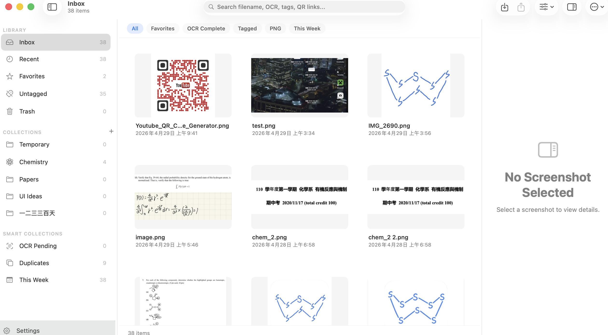
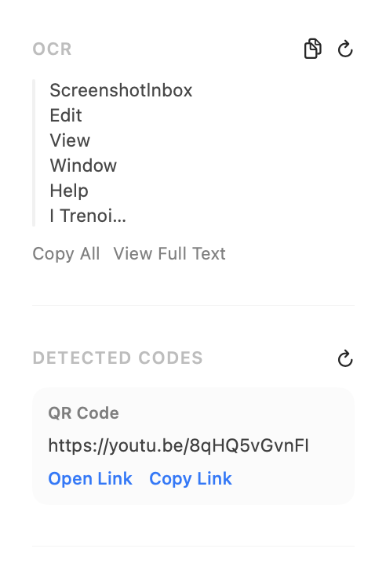
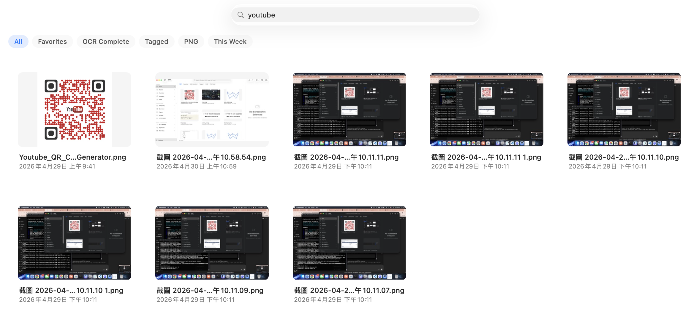
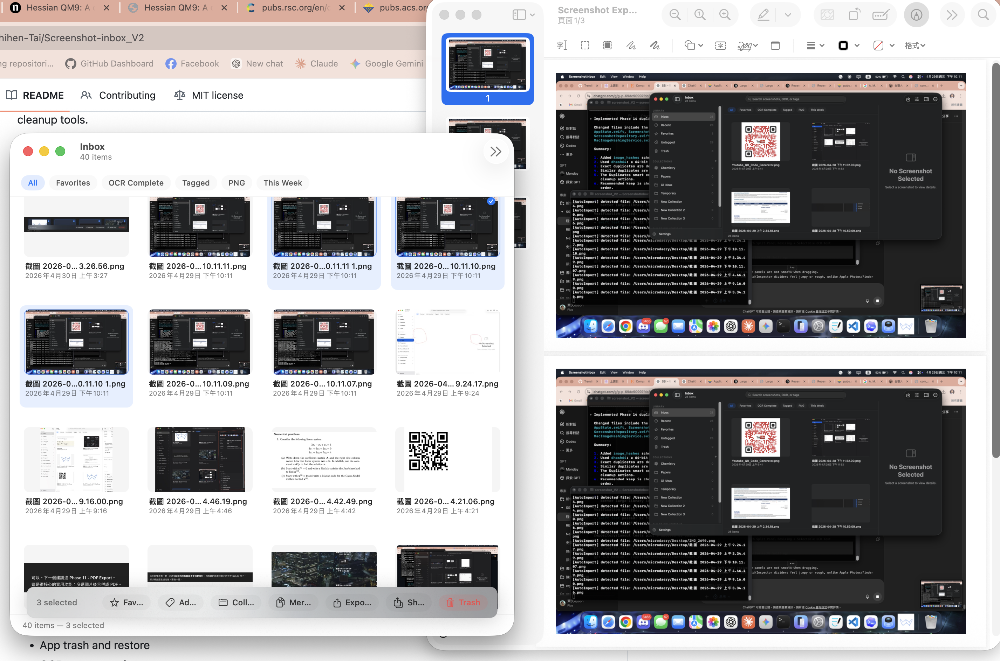
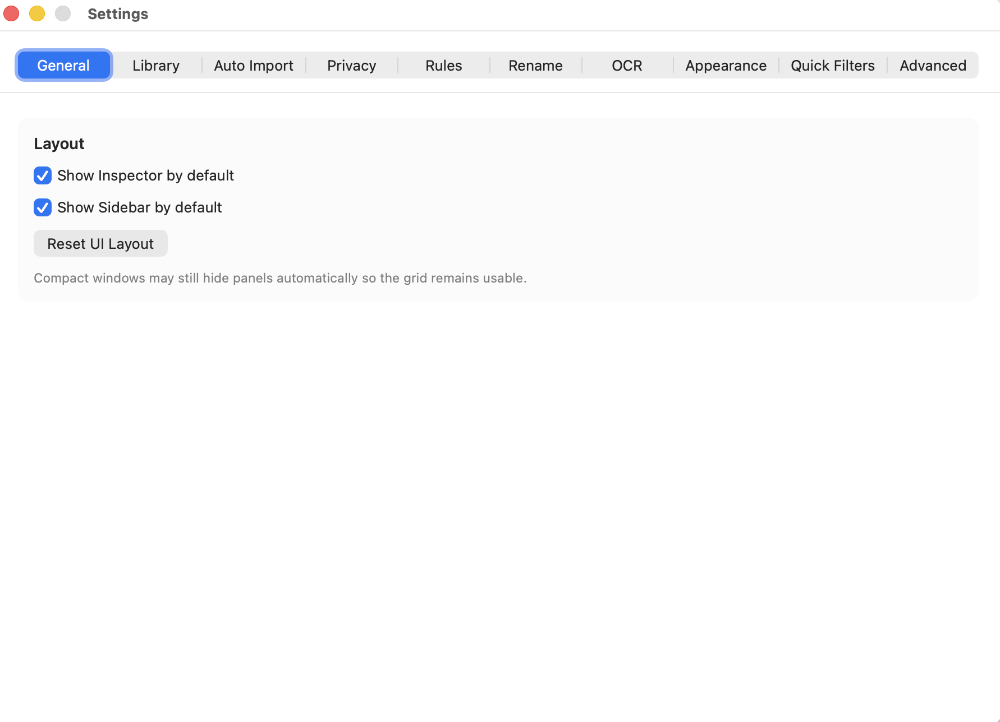

# Screenshot Inbox

Screenshot Inbox is a native macOS app for collecting, organizing, searching, and exporting screenshots. It is local-first, uses a managed library on your Mac, and supports OCR, QR code detection, tags, collections, PDF export, and cleanup tools.

## Overview

Screenshot Inbox helps keep screenshots out of scattered folders by importing them into a local managed library. From there, you can organize screenshots with tags and collections, search by filename or extracted text, detect QR codes and links, export selected items, and safely clean up with app-level Trash and restore.

## Installation(RECOMMAND)

```bash
git clone https://github.com/Chihen-Tai/Screenshot-inbox_V2.git
cd Screenshot-inbox_V2
swift build
swift run ScreenshotInbox
```

The project is a Swift Package Manager executable target, not an Xcode project. If you prefer Xcode, open `Package.swift`.

## Screenshots


### Main window



### OCR and search




### PDF export



### Settings




<!-- Add screenshot: docs/images/main-window.png -->
<!-- Add screenshot: docs/images/ocr-and-search.png -->
<!-- Add screenshot: docs/images/pdf-export.png -->
<!-- Add screenshot: docs/images/settings.png -->

## Features

- Native macOS interface
- Local screenshot library
- Manual image import
- Auto import from watched folders
- Sidebar collections
- Tags
- Favorites
- App trash and restore
- OCR text extraction
- QR code and link detection
- Search across filenames, OCR text, tags, collections, and detected codes
- Export selected screenshots as PDF
- Export and share original images
- Duplicate and cleanup tools
- Library maintenance and repair tools

## Requirements

- macOS 14 or later, based on the package platform declaration.
- Swift 5.10 or later, based on `Package.swift`.
- Xcode 15.3 or later is recommended for Swift 5.10 and macOS SDK support.
- OCR and QR detection use Apple frameworks and require macOS support for the relevant Vision APIs.

## Release Builds

The current development pre-release version is `0.4.0-alpha-dev` with build `4`.

Create a local release app bundle:

```bash
scripts/build-release.sh
```

Create a ZIP package:

```bash
scripts/package-zip.sh
```

Release packaging, signing, notarization, and manual QA steps are documented in `docs/RELEASE.md`.

## Usage

1. Import screenshots manually, or enable watched folders for auto import.
2. Organize screenshots with collections, tags, and favorites.
3. Use OCR and search to find screenshots by text, filenames, tags, collections, or detected codes.
4. Use QR detection to open or copy links found in screenshots.
5. Select screenshots and export them as a PDF or export/share originals.
6. Use Trash and Restore for safe cleanup before permanent deletion.
7. Use library maintenance tools if thumbnails, OCR records, or library files need repair.

## Project Structure

```text
ScreenshotInbox/
  App/                 SwiftUI app entry, app state, commands, permissions
  AppKitBridge/        NSCollectionView grid, selection, drag/drop, shortcuts
  Core/                Shared protocols
  Models/              App value types
  Persistence/         SQLite repositories and migrations
  Platform/macOS/      macOS-specific services
  Resources/           Assets and localized strings
  Services/            Import, OCR, QR detection, search, export, maintenance
  UI/                  SwiftUI views
  Utilities/           Shared helpers and design tokens
Tests/
  ScreenshotInboxTests/
```

See `ARCHITECTURE.md` for more detail.

## Privacy

Screenshot Inbox is local-first. It does not upload your screenshots or OCR text to any server.

Screenshots are stored in a local managed library on your Mac. OCR and QR detection run locally using Apple frameworks. No account is required, no telemetry or network services are included, and watched folders are limited to the folders configured in Settings. Import, rename, trash, and delete workflows operate on managed Screenshot Inbox copies by default, not the original source files on your Desktop, Downloads, or other folders. Optional Source Folder Sync settings can rename or move original source files to macOS Trash only when explicitly enabled.

See `PRIVACY.md` for details.

## Current Status

Screenshot Inbox is in active pre-release development. Core local-library, import, organization, OCR, QR detection, search, PDF export, trash, and maintenance workflows exist, but the project still needs release packaging, broader manual QA, and public issue triage before a stable release.

## Roadmap

See `ROADMAP.md`.

## Contributing

Contributions are welcome. Please read `CONTRIBUTING.md` before opening issues or pull requests.

## License

MIT License. See `LICENSE`.

## Chinese Note

Screenshot Inbox 是一個本機優先的 macOS 截圖整理工具。主要說明文件以英文維護，歡迎補充繁體中文文件。
